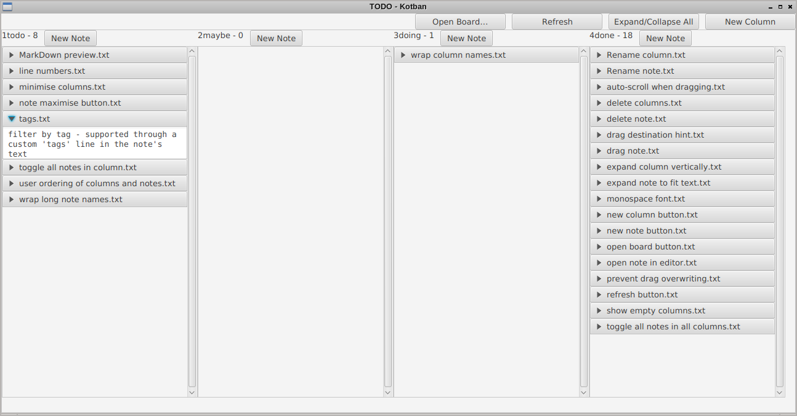

Kotban
======

A kanban viewer for boards whose contents are stored as a directory tree in git.

Each card is a text file and each column is a directory, 
so changes to the board can be reflected sanely in commits.

A directory containing:

```
board
├── 1todo
│   ├── line numbers.txt
│   ├── MarkDown preview.txt
│   ├── minimise columns.txt
│   ├── note maximise button.txt
│   ├── tags.txt
│   ├── toggle all notes in column.txt
│   ├── user ordering of columns and notes.txt
│   └── wrap long note names.txt
├── 2maybe
├── 3doing
│   └── wrap column names.txt
└── 4done
    ├── auto-scroll when dragging.txt
    ├── delete columns.txt
    ├── delete note.txt
    ├── drag destination hint.txt
    ├── drag note.txt
    ├── expand column vertically.txt
    ├── expand note to fit text.txt
    ├── monospace font.txt
    ├── new column button.txt
    ├── new note button.txt
    ├── open board button.txt
    ├── open note in editor.txt
    ├── prevent drag overwriting.txt
    ├── refresh button.txt
    ├── Rename column.txt
    ├── Rename note.txt
    ├── show empty columns.txt
    └── toggle all notes in all columns.txt

```

becomes:



* each subdir of `board` is a column
* each text file in a column directory is a card in that column 
* columns are displayed in alphabetical order, so preface them with numbers if you want a specific order

files can be plain text or markdown; no syntax highlighting or preview is supported (yet!)

[recognised plaintext file extensions](src/main/kotlin/com/github/medavox/kotban/FileExtensions.kt) are `txt`, `md`, `markdown`, `cfg`, `ini`, `config`, `textile`, `rst`, `asc`.

Other files are ignored, which gives you flexibility in storing supporting files (images, code...) with the tasks.

Files in the same directory as the column directories are also ignored; 
you can provide a board README here (for your own documentation purposes) if you want.

Creation, deletion, moving and renaming of cards and columns can be done in the app,
but you must open text files in your own text editor to actually edit them (There is a context menu item for this).

This is more a viewer than a full-fledged text editor.

It's still your responsibility to create and manage the git repo - make commits etc.
